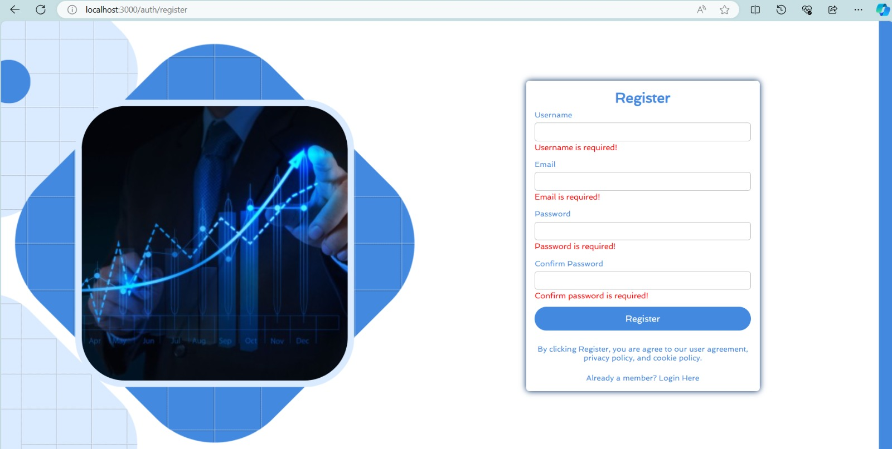
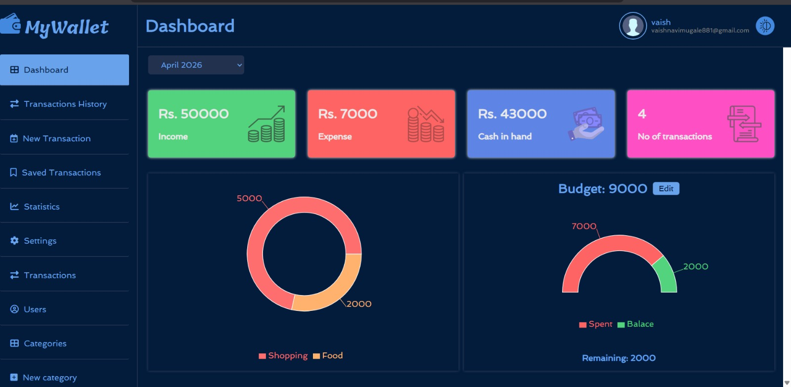
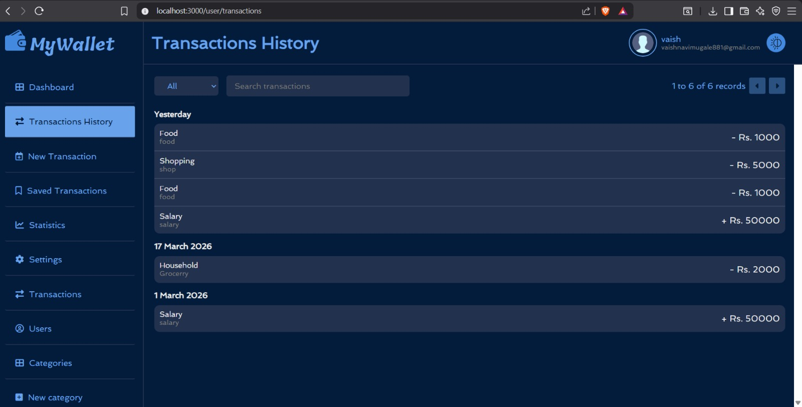
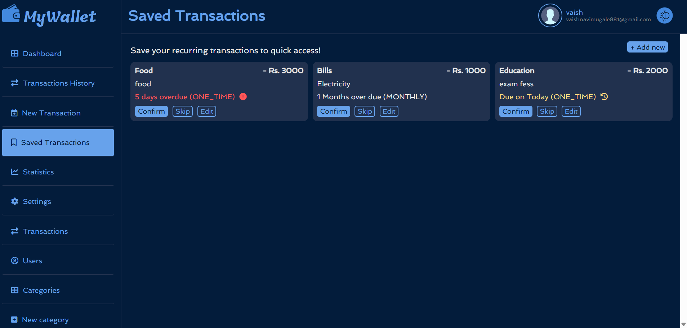
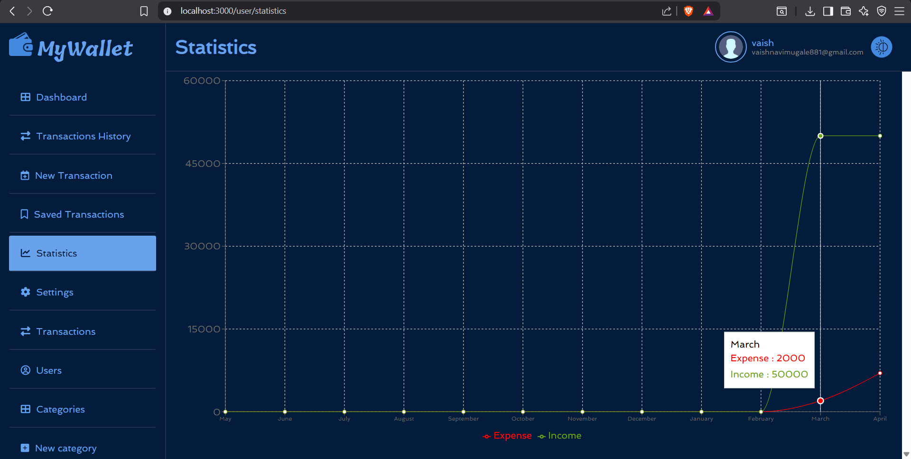
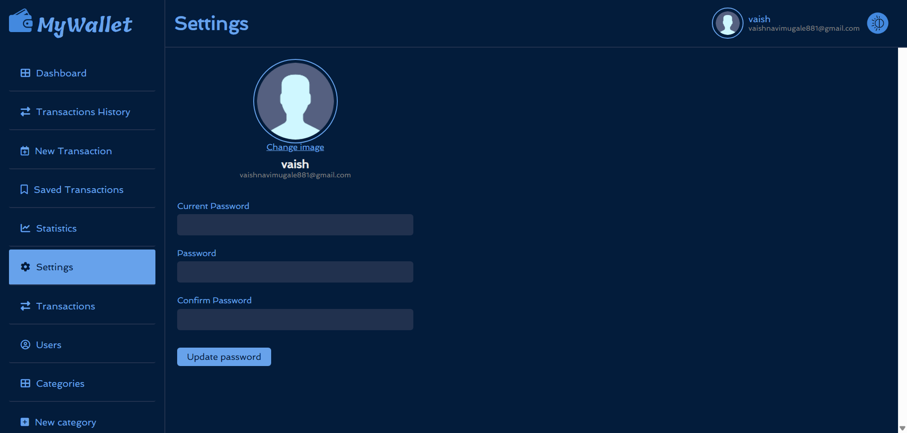
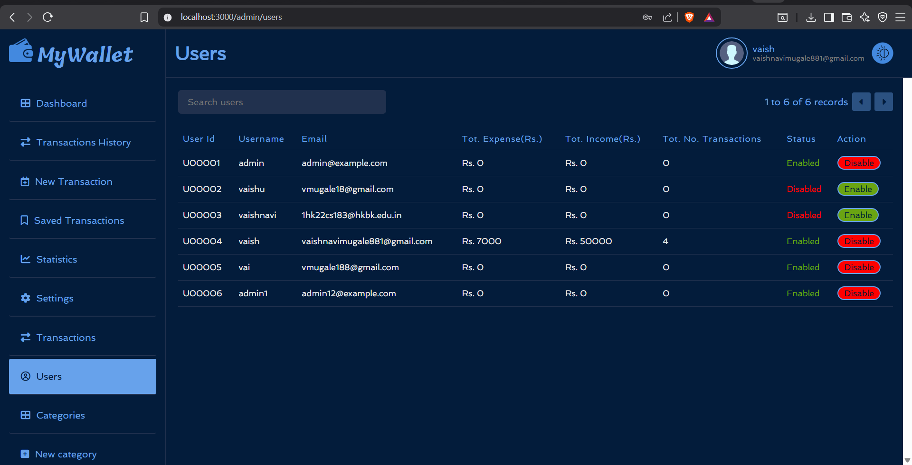
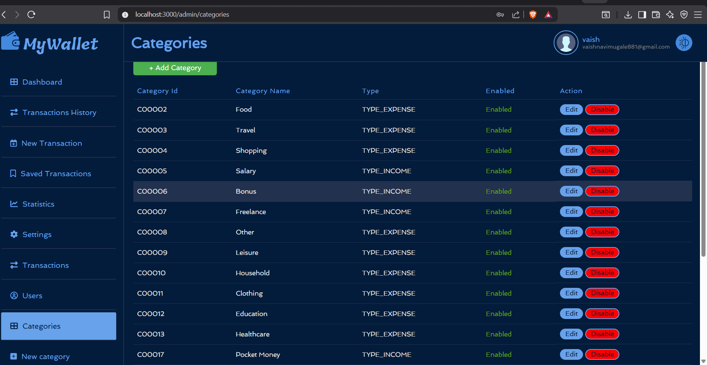
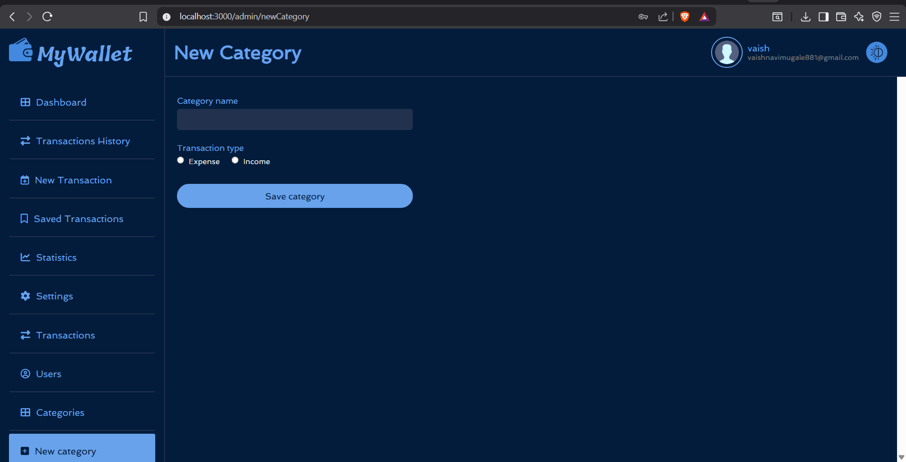

# 🌟 MyWallet – Expense Tracking Application

A full-stack expense tracking web application built using **Spring Boot**, **React.js**, and **MySQL**.
It helps users manage daily finances, track income & expenses, and visualize spending patterns.

---

## 🚀 Features

### 🔐 Authentication & Security

* User Registration & Login
* JWT-based Authentication
* Role-Based Access Control (RBAC)
* Password Reset & Email Verification

### 💰 Expense Management

* Add, Edit, Delete Transactions
* Categorize Expenses (Food, Travel, Bills, etc.)
* Track Income & Expenses separately
* Real-time balance updates

### 📊 Dashboard & Insights

* Visual representation of spending
* Category-wise expense tracking
* Clean and intuitive UI

### 🛠️ Admin Features

* Manage Categories
* View all users & transactions
* Control system-level settings

---

## 🧑‍💻 Tech Stack

### Frontend

* React.js
* Axios
* CSS

### Backend

* Spring Boot
* Spring Security
* REST APIs

### Database

* MySQL

---

## ⚙️ How to Run Locally

### 🔹 Backend

1. Navigate to backend folder:

   ```bash
   cd backend
   ```
2. Configure MySQL in `application.properties`
3. Run:

   ```bash
   mvn spring-boot:run
   ```

---

### 🔹 Frontend

1. Navigate to frontend folder:

   ```bash
   cd frontend
   ```
2. Install dependencies:

   ```bash
   npm install
   ```
3. Start app:

   ```bash
   npm start
   ```

---

## 📸 Screenshots

### 🏠 Home  


### 🔐 Login  


### 📝 Register  


### 📊 Dashboard  


### 📜 Transaction History  


### 💾 Saved Transaction  


### 📈 Statistics  


### ⚙️ Settings  


### 👥 Users  


### 🗂️ Categories  


### ➕ New Category  



---

## ✨ Key Highlights

* Full-stack application with secure authentication
* Clean UI with real-time updates
* Scalable backend using Spring Boot
* Proper separation of frontend & backend

---

## 📌 Future Improvements

* Export reports (PDF/Excel)
* Mobile responsiveness
* AI-based expense insights

---

## 👩‍💻 Author

**Vaishnavi Mugale**
GitHub: https://github.com/VaishnaviMugale538

---

